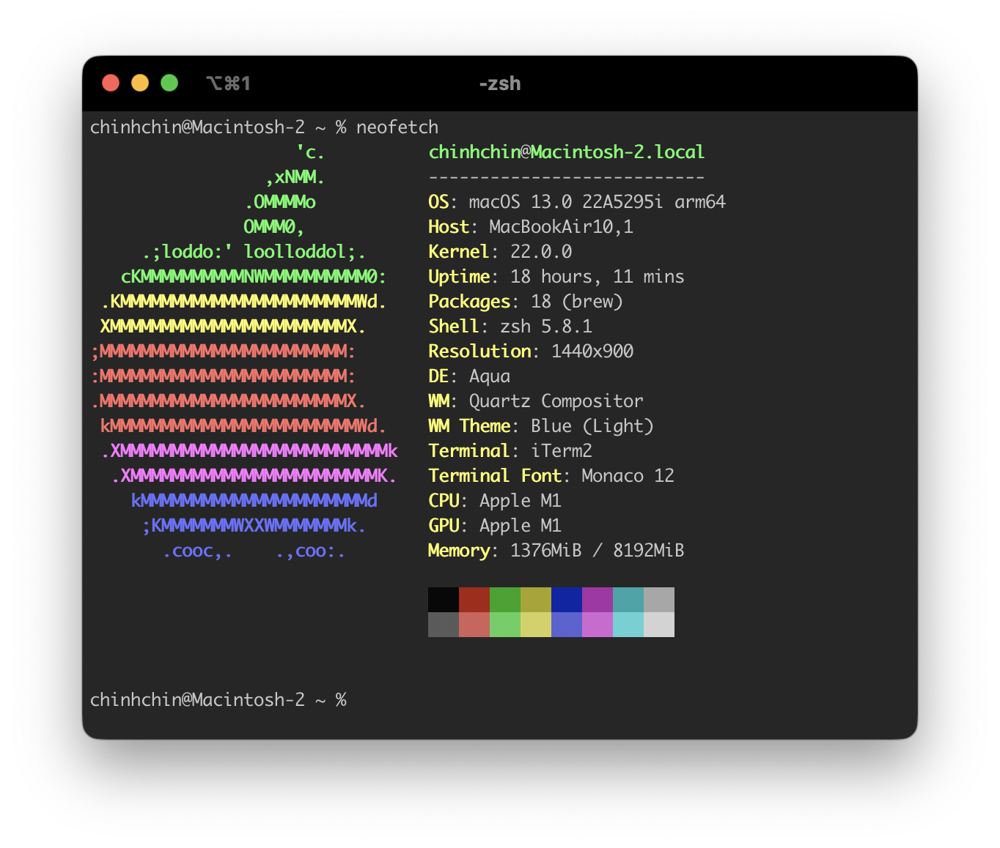
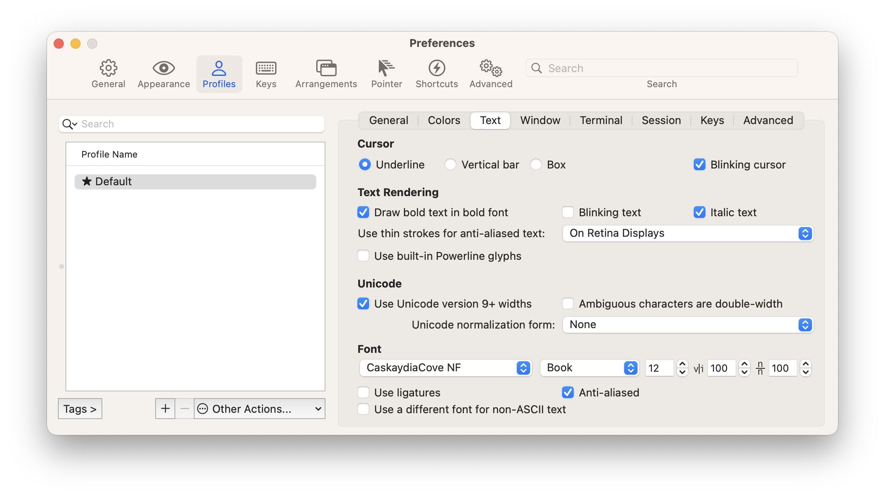
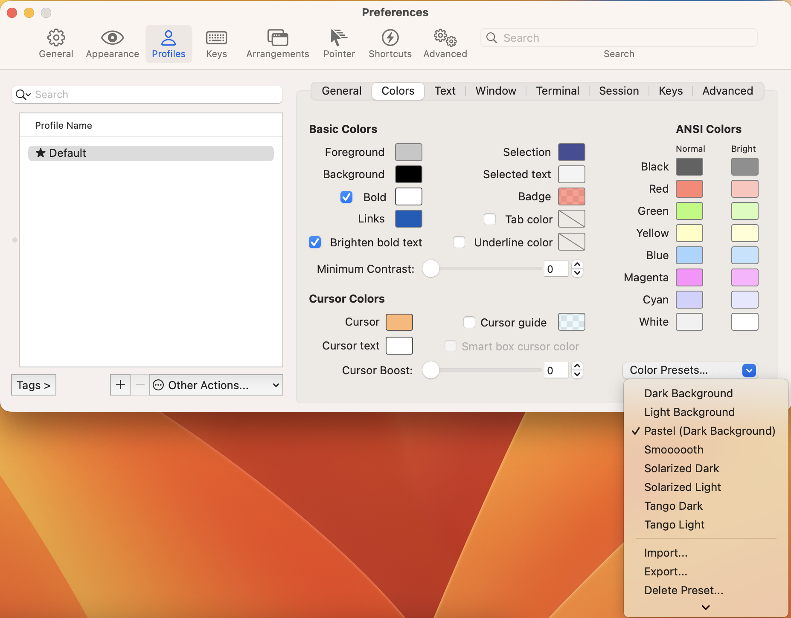
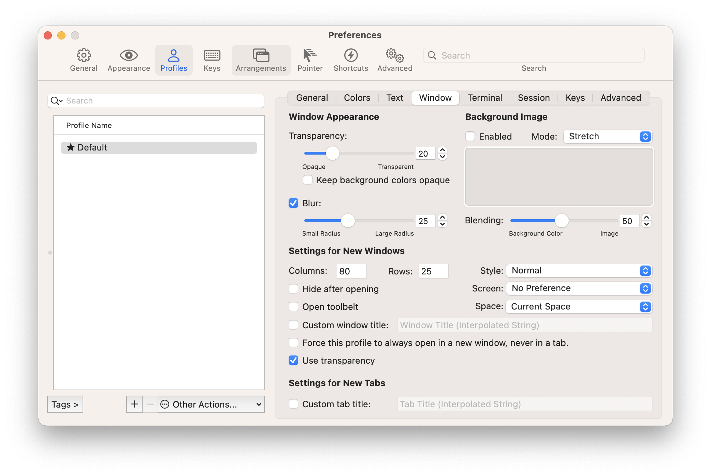

# **My Iterm2 setup**
This is my Iterm2 setup to make terminal in macOS look better to increase more productivity and speed of my workflow.

### **Image Preview**


### **See**
- [Versions Recording](./versions.json)

### **OS support**
- macOS

### **Package requirement**
- [Brew](https://github.com/chinhchin/Brew-setup.git)

### **Contents**
#### **[1. Install Iterm2](./readme.md#1-install-iterm2)**
#### **[2. Config Iterm2](./readme.md#2-config-iterm2)**
1. [Text](./readme.md#21-text)
2. [Colors Presents](./readme.md#22-colors-presents) 
3. [Window Appearance](./readme.md#23-window-appearance)

---
## **1. Install Iterm2**
(Don't forget to install [Brew](https://github.com/achinhchin/Brew-setup.git) before continue.)

(Type these commands to your terminal.)
```
brew install --cask iterm2
```

## **2. Config Iterm2**
Open Settings in Iterm2 by press *Cmd + ,*.
### **2.1 Text**

At **Profiles** tab, in **Text** bar, select **Cursur** to *Underline* and **Font** to *CaskaydiaCove NF*.

### **2.2 Colors Presents**

At **Profiles** tab, in **Colors** bar, select **Color Presents...** to *Pastel (Dark Background)*.

### **2.3 Window Appearance**

At **Profiles** tab, in **Window** bar, select **Transparency** to *20*, **Blur** to *25* and mark as *Blur* checkbox.
